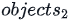

# Day 4: Count Objects

## Problem

### Objective

<p>In this challenge, we learn about iterating over objects. Check the attached tutorial for more details.</p>

### Task

<p>Complete the function in the editor. It has one parameter: an array, <b><i>a</i></b>, of objects. Each object in the array has two integer properties denoted by <b><i>x</i></b> and <b><i>y</i></b>. The function must return a count of all such objects <b><i>o</i></b> in array <b><i>a</i></b> that satisfy <b><i>o.x == o.y</i></b>.</p>

### Input Format

<p>The first line contains an integer denoting <b><i>n</i></b>.
</p>
<p>Each of the <b><i>n</i></b> subsequent lines contains two space-separated integers describing the values of <b><i>x</i></b> and <b><i>y</i></b>.</p>

### Constraints

- 5 ≤ <b><i>n</i></b> ≤ 10
- 1 ≤ <b><i>x,y</i></b> ≤ 100

### Output Format

<p>Return a count of the total number of objects <b><i>o</i></b> such that <b><i>o.x == o.y</i></b>. Locked stub code in the editor prints the returned value to STDOUT.</p>

### Sample Input 0

```
5
1 1
2 3
3 3
3 4
4 5
```

### Sample Output 0

```
2
```

### Explanation 0

<p>There are <b><i>n=5</i></b> objects in the <b><i>objects</i></b> array: </p>


<span>Because we have two objects <b><i>o</i></b> that satisfy <b><i>o.x == o.y</i></b> (i.e., &nbsp; and ), we return <b>2</b> as our answer.</span>
