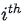
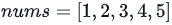
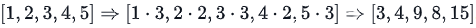

# Day 5: Arrow Functions

## Problem

### Objective

<p>In this challenge, we practice using arrow functions. Check the attached tutorial for more details.</p>

### Task

<p>Complete the function in the editor. It has one parameter: an array, <b><i>nums</i></b>. It must iterate through the array performing one of the following actions on each element:</p>

1. If the element is even, multiply the element by <b><i>2</i></b>.
2. If the element is odd, multiply the element by <b><i>3</i></b>.

<p>The function must then return the modified array.</p>

### Input Format

<p>The first line contains an integer, <b><i>n</i></b>, denoting the size of <b><i>nums</i></b>.</p>
<p>The second line contains <b><i>n</i></b> space-separated integers describing the respective elements of <b><i>nums</i></b>.</p>

### Constraints

- 1 ≤ <b><i>n</i></b> ≤ 10
- 1 ≤ <b><i>numsi</i></b> ≤ 100 , where <b><i>numsi</i></b> is the  element of <b><i>nums</i></b>.

### Output Format

<p>Return the modified array where every even element is doubled and every odd element is tripled.</p>

### Sample Input 0

```
5
1 2 3 4 5
```

### Sample Output 0

```
3 4 9 8 15
```

### Explanation 0

<p>Given , we modify each element so that all even elements are multiplied by <b>2</b> and all odd elements are multipled by <b>3</b>. In other words,  . We then return the modified array as our answer.</p>
