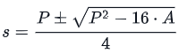
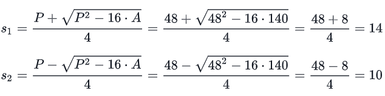

# Day 5: Template Literals

## Problem

### Objective

<p>In this challenge, we practice using JavaScript Template Literals. Check the attached tutorial for more details.</p>

### Task

<p>The code in the editor has a tagged template literal that passes the area and perimeter of a rectangle to a tag function named sides. Recall that the first argument of a tag function is an array of string literals from the template, and the subsequent values are the template's respective expression values.</p>
<p>Complete the function in the editor so that it does the following:</p>

1. Finds the initial values of <b><i>s1</i></b> and <b><i>s2</i></b> by plugging the area and perimeter values into the formula:

<div align="center"></div>
<span>where <b><i>A</i></b> is the rectangle's area and <b><i>P</i></b> is its perimeter.</span>

2. Creates an array consisting of <b><i>s1</i></b> and <b><i>s2</i></b> and sorts it in ascending order.
3. Returns the sorted array.

### Input Format

<p>The first line contains an integer denoting <b><i>s1</i></b>.</p>
<p>The second line contains an integer denoting <b><i>s2</i></b>.</p>

### Constraints

- 1 ≤ <b><i>s1,s2</i></b> ≤ 100

### Output Format

<p>Return an array consisting of <b><i>s1</i></b> and <b><i>s2</i></b>, sorted in ascending order.</p>

### Sample Input 0

```
10
14
```

### Sample Output 0

```
10
14
```

### Explanation 0

<p>The locked code in the editor passes the following arrays to the tag function: </p>

- The value of <b><i>literals</i></b> is [ 'The area is: ', '.\nThe perimeter is: ', '.' ].
- The value of <b><i>expressions</i></b> is [ 140, 48 ], where the first value denotes the rectangle's area, <b><i>A</i></b>, and the second value denotes its perimeter, <b><i>P</i></b>.

<p>When we plug those values into our formula, we get the following:</p>

<div align="center"></div>
<p>We then store these values in an array, [14, 10], sort the array, and return the sorted array, [10, 14], as our answer.</p>
