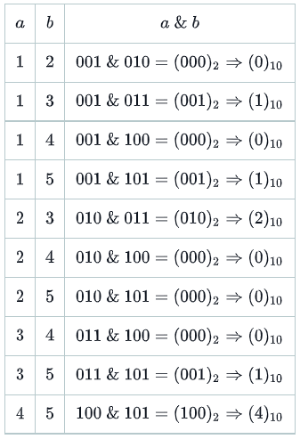

# Day 6: Bitwise Operators

## Problem

### Objective

<p>Today, we're practicing bitwise operations. Check the attached tutorial for more details.</p>

### Task

<p>We define <b><i>S</i></b> to be a sequence of distinct sequential integers from <b>1</b> to <b><i>n</i></b>; in other words, <b><i>S</i></b> = <b>{1,2,3,...,n}</b>. We want to know the maximum bitwise AND value of any two integers, <b><i>a</i></b> and <b><i>b</i></b> (where <b> a < b </b>), in sequence <b><i>S</i></b> that is also less than a given integer, <b><i>k</i></b>.</p>
<p>Complete the function in the editor so that given <b><i>n</i></b> and <b><i>k</i></b>, it returns the maximum <b><i>a & b < k </i></b>.</p>
<p><b>Note :</b> The <b><i>&</i></b> symbol represents the <a href="https://en.wikipedia.org/wiki/Bitwise_operation#AND">bitwise AND</a> operator.</p>

### Input Format

<p>The first line contains an integer, <b><i>q</i></b>, denoting the number of function calls.</p>
<p>Each of the <b><i>q</i></b> subsequent lines defines a dataset for a function call in the form of two space-separated integers describing the respective values of <b><i>n</i></b> and <b><i>k</i></b>.</p>

### Constraints

- 1 ≤ <b><i>q</i></b> ≤ 10³
- 2 ≤ <b><i>n</i></b> ≤ 10³
- 2 ≤ <b><i>k</i></b> ≤ <b><i>n</i></b>

### Output Format

<p>Return the maximum possible value of <b><i>a & b < k </i></b> for any <b><i>a < b </i></b> in sequence <b><i>S</i></b>.</p>

### Sample Input 0

```
3
5 2
8 5
2 2
```

### Sample Output 0

```
1
4
0
```

### Explanation 0

<p>We perform the following <b><i>q</i></b> = <b>3</b> function calls:</p>

1. When <b><i>n</i></b> = <b>5</b> and <b><i>k</i></b> = <b>2</b>, we have the following possible <b><i>a</i></b> and <b><i>b</i></b> values in set <b><i>S</i></b> = <b>{1,2,3,4,5}</b>:

<div align="center">
  
</div>

<p>The maximum of any <b><i>a & b</i></b> that is also <b><i> < k </i></b> is <b>1</b>, so we return <b>1</b>.</p>

2. When <b><i>n</i></b> = <b>8</b> and <b><i>k</i></b> = <b>5</b>, the maximum of any <b><i>a & b < k </i></b> in set <b><i>S</i></b> = <b>{1,2,3,4,5,6,7,8}</b> is <b>4</b> (see table above), so we return <b>4</b>.
3. When <b><i>n</i></b> = <b>2</b> and <b><i>k</i></b> = <b>2</b>, the maximum of any <b><i>a & b < k </i></b> in set <b><i>S</i></b> = <b>{1,2}</b> is <b>0</b> (see table above), so we return <b>0</b>.

### Sample Input 1

```
2
9 2
8 3
```

### Sample Output 1

```
1
2
```

### Explanation 1

<p>We perform the following <b><i>q</i></b> = <b>2</b> function calls:</p>

1. When <b><i>n</i></b> = <b>9</b> and <b><i>k</i></b> = <b>2</b>, the maximum of any <b><i>a & b < k </i></b> in set <b><i>S</i></b> = <b>{1,2,3,4,5,6,7,8,9}</b> is <b>1</b> (see table above), so we return <b>1</b>.
2. When <b><i>n</i></b> = <b>8</b> and <b><i>k</i></b> = <b>3</b>, the maximum of any <b><i>a & b < k </i></b> in set <b><i>S</i></b> = <b>{1,2,3,4,5,6,7,8}</b> is <b>2</b> (see table above), so we return <b>2</b>.
