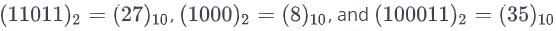

# Day 9: Binary Calculator

## Problem

### Objective

<p>In this challenge, we implement a calculator that uses binary numbers. Check out the attached tutorial for learning materials.</p>

### Task

<p>Implement a simple calculator that performs the following operations on binary numbers: addition, subtraction, multiplication, and division. Note that division operation must be integer division only; for example, <b><i> 1001/100 = 10, 1110/101 = 10, and 101/1 = 101.</i></b></p>

<p>The calculator's initial state must look like this:</p>

<div align="center">


</div>

- Element IDs. Each element in the document must have an id, specified below:

<table class="challenge-body-table" align="center">
    <thead>
        <tr>
            <th align="center"><code>innerHTML</code></th>
            <th align="center"><code>id</code></th>
            <th align="left">Description/Behavior</th>
        </tr>
    </thead>
    <tbody>
        <tr>
            <td align="center"></td>
            <td align="center"><code>res</code></td>
            <td align="left">Contains the result of button presses.</td>
        </tr>
    <tr>
        <td align="center"></td>
        <td align="center"><code>btns</code></td>
        <td align="left">A button container that displays all eight calculator buttons.</td>
    </tr>
    <tr>
        <td align="center"><code>0</code></td>
        <td align="center"><code>btn0</code></td>
        <td align="left">A button expressing binary digit <b>0</b>.</td>
    </tr>
    <tr>
        <td align="center"><code>1</code></td>
        <td align="center"><code>btn1</code></td>
        <td align="left">A button expressing binary digit <b>1</b>.</td>
    </tr>
    <tr>
        <td align="center"><code>C</code></td>
        <td align="center"><code>btnClr</code></td>
        <td align="left">A button to clear the contents of <b><i>res</i></b>.</td>
    </tr>
    <tr>
        <td align="center"><code>=</code></td>
        <td align="center"><code>btnEql</code></td>
        <td align="left">A button to evaluate the contents of the expression in <b><i>res</i></b>.</td>
    </tr>
    <tr>
        <td align="center"><code>+</code></td>
        <td align="center"><code>btnSum</code></td>
        <td align="left">A button for the addition operation.</td>
    </tr>
    <tr>
        <td align="center"><code>-</code></td>
        <td align="center"><code>btnSub</code></td>
        <td align="left">A button for the subtraction operation.</td>
    </tr>
    <tr>
        <td align="center"><code>*</code></td>
        <td align="center"><code>btnMul</code></td>
        <td align="left">A button for the multiplication operation.</td>
    </tr>
    <tr>
        <td align="center"><code>/</code></td>
        <td align="center"><code>btnDiv</code></td>
        <td align="left">A button for the integer division operation.</td>
    </tr>
    </tbody>
</table>

- Styling. The document's elements must have the following styles:
  - body has a width of 33%.
  - res has a background-color of lightgray, a border that is solid, a height of 48px, and a font-size of 20px.
  - btn0 and btn1 have a background-color of lightgreen and a color of brown.
  - btnClr and btnEql have a background-color of darkgreen and a color of white.
  - btnSum, btnSub, btnMul, and btnDiv have a background-color of black, a color of red.
  - All the buttons in btns have a width of 25%, a height of 36px, a font-size of 18px, margin of 0px, and float value left.

<p>The .js and .css files are in different directories, so use the link tag to provide the CSS file path and the script tag to provide the JS file path:</p>

```html
<!DOCTYPE html>
<html>
  <head>
    <link rel="stylesheet" href="css/binaryCalculator.css" type="text/css" />
  </head>

  <body>
    <script src="js/binaryCalculator.js" type="text/javascript"></script>
  </body>
</html>
```

### Constraints

- All expressions in the test dataset are entered in the form <b><i>operand1 -> operator -> operand2</i></b>, where <b><i>operand1</i></b> is the first binary number, <b><i>operand2</i></b> is the second binary number, and <b><i>operator</i></b> is in the set <b>{+,-,\*,=}</b>.
- Both operands will always be positive integers when converted from base-<b>2</b> to base-<b>10</b>.
- All expressions will be valid.

### Explanation

<p>Consider the following sequence of button clicks:</p>
<br>
<p align="center">1 -> 1 -> 0 -> 1 -> 1 -> + -> 1 -> 0 -> 0 -> 0 -> =</p>
<br>
<p>Before pressing the <b>=</b> button, the result div looks like this:</p>
<div align="center">


</div>
<p>After pressing the <b>=</b> button to evaluate our expression, the result div looks like this:</p>
<div align="center">


</div>
<p style="display:flex;align-items:center">Notice that &nbsp;&nbsp; , and , so our calculator evaluated the expression correctly.</p>
<p>Now, let's consider our next sequence of button clicks as:</p>
<br>
<p align="center">0 -> 1 -> * 1 -> 1 -> 1 -> =</p>
<br>
<p>Before pressing the <b>=</b> button, the result div looks like this:</p>
<div align="center">


</div>
<p>After pressing the <b>=</b> button to evaluate our expression, the result div looks like this:</p>
<div align="center">


</div>
<p>Consider the next sequence of button clicks as:</p>
<br>
<p align="center">C -> 1 -> 1</p>
<br>
<p>The result div looks like this:</p>
<div align="center">


</div>
